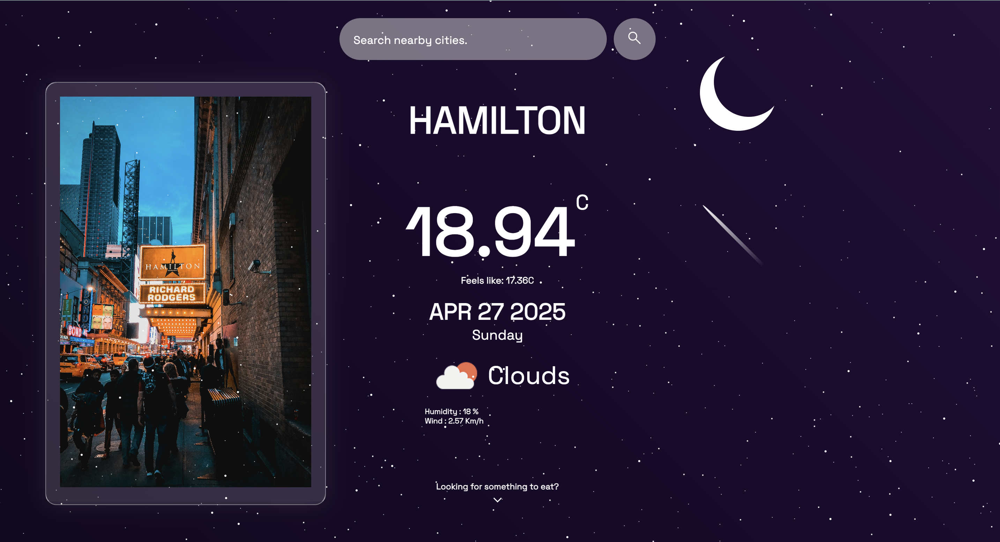
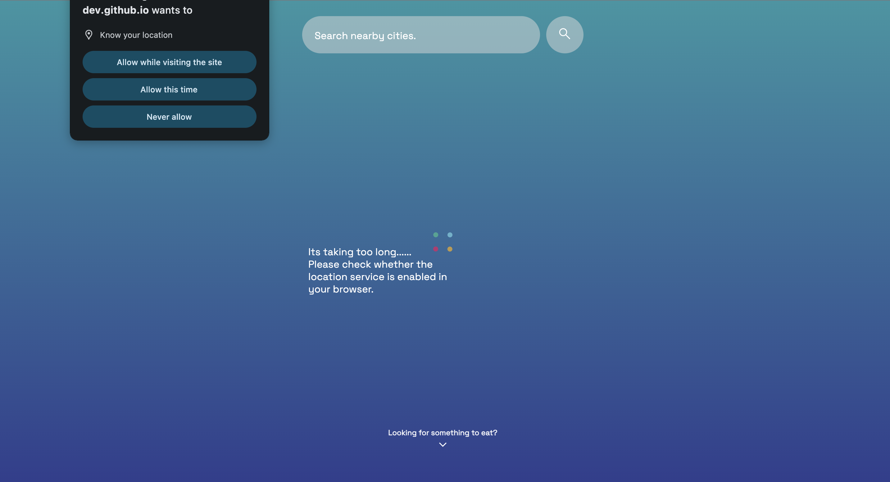

# Weather App


## 🚀 Overview

Welcome to the **Weather App**, a sleek, retro-inspired web application that brings real-time weather data right to your fingertips. Built with pure HTML, CSS, and JavaScript, this project showcases modern API integration and responsive design in a minimalistic package.

Key Features:

- 🌍 **Geolocation Integration**: Automatically fetches and displays the current weather for the user's location.
- 🔍 **Search Functionality**: Allows users to search for weather by city name.
- 🌡️ **Real-Time API Calls**: Utilizes a public weather API to fetch up-to-date conditions.
- 📱 **Responsive Design**: Adapts seamlessly to any device, from desktop to mobile.
- 🎨 **Retro Theme**: Dark theme with colorful accents for a nostalgic feel.

---

## 📂 Project Structure

```bash
Weather_Project/
├── index.html       # Main HTML file
├── css/
│   └── styles.css   # Styling for the application
├── js/
│   └── app.js       # JavaScript logic and API calls
├── assets/
│   ├── icons/       # Weather icons and assets
│   └── demo.png     # Demo screenshot for README
├── .gitignore       # Git ignore rules
└── README.md        # Project documentation
```

---

## 🛠️ Technologies Used

- **HTML5 & CSS3**: Structure and styling
- **Vanilla JavaScript**: Application logic and API interactions
- **OpenWeatherMap API**: Real-time weather data
- **Axios (optional)**: Promise-based HTTP client for cleaner API calls
- **Responsive Design**: Media queries for device compatibility

---

## 🔧 Installation & Setup

1. **Clone the Repository**
   ```bash
   git clone https://github.com/HariShanmugam-dev/Weather_Project.git
   cd Weather_Project
   ```
2. **Obtain an API Key**

&#x20;  \- Sign up at [OpenWeatherMap]\([https://openweathermap.org/](https://openweathermap.org/)) to get your free API key.

&#x20;  \- Create a \`.env\` file in the root directory and add:

&#x20; &#x20;

```
env WEATHER_API_KEY=your_api_key_here
```

3. **Run Locally**
   - Since this is a static site, you can simply open `index.html` in your browser, or
   - Use a local HTTP server for better CORS handling:
   # Using Python 3
   ```bash
     python -m http.server 8000
   ```
   # Using Node.js
   ```
   npx http-server .
   ```
5. **View the App**
   Visit `http://localhost:8000` in your browser.

---

## 💡 Usage

- On page load, grant location access to see your current weather conditions.
- Use the search bar to type any city name and press **Enter** or click **Search**.
- The app displays:
  - Current temperature (°C/°F)
  - Weather description (e.g., Clear, Rain, Clouds)
  - Humidity, wind speed, and more

---

## 📈 Screenshots


---

## 🧪 Testing

- Manual testing across desktop, tablet, and mobile viewports.
- Verified API error handling for invalid city names.

---

## 🤝 Contributing

Contributions are welcome! Please fork the repo and open a pull request with your improvements.

1. Fork it
2. Create your feature branch (`git checkout -b new-feature`)
3. Commit your changes (`git commit -m 'Add some feature'`)
4. Push to the branch (`git push origin new-feature`)
5. Open a Pull Request

---

## 📜 License

This project is licensed under the MIT License.

---

## 🙏 Acknowledgements

- Thanks to [OpenWeatherMap](https://openweathermap.org/) for the API
- Inspired by retro UI designs and classic gaming interfaces

---

*Developed by Hari Hara Sudhan Shanmugam*

